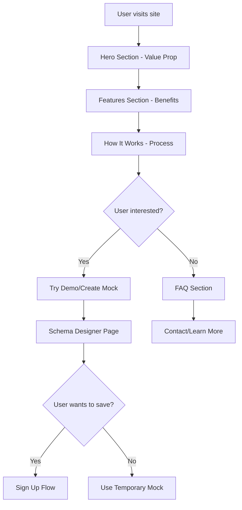
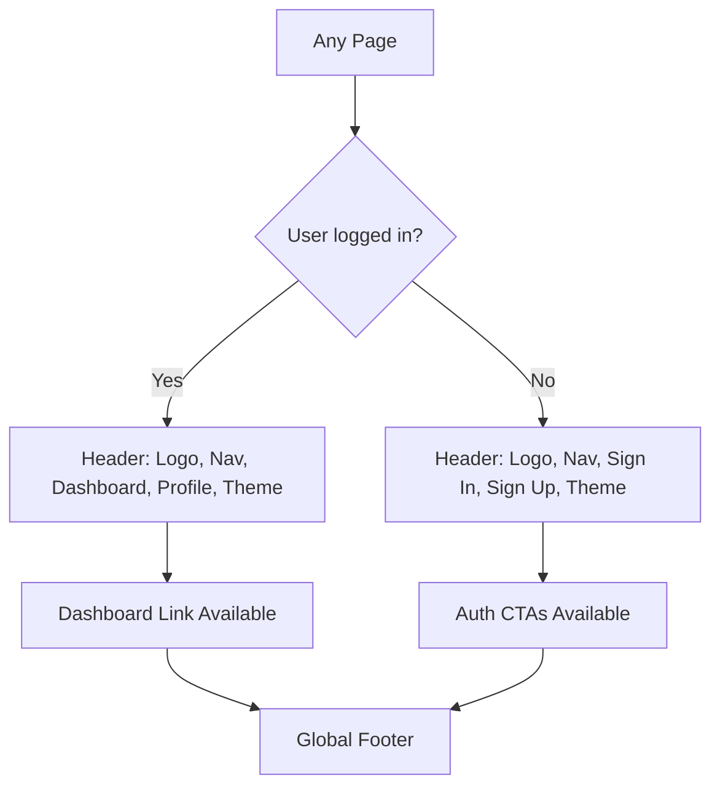

# 🏠 Mocklyst Landing Page & Global Navigation
## Product Requirements Document (PRD)

---

## 1. Overview

### Problem Statement

The current Mocklyst application lacks:
- A proper marketing-focused landing page with clear value proposition
- Global navigation structure for seamless user experience
- Consistent header/footer across all pages
- Easy access to theme switching throughout the application
- Clear navigation between public content and authenticated user features

### Solution

Implement a comprehensive landing page with:
1. **Marketing-focused landing page** with clear sections and navigation
2. **Global header/footer** present on all application pages
3. **Smart navigation** that adapts based on authentication status
4. **Universal theme toggle** accessible from any page
5. **Smooth scrolling navigation** to different landing page sections

---

## 2. Product Objectives

- **Improve user onboarding**: Clear value proposition and feature explanation
- **Professional appearance**: Consistent header/footer across all pages
- **Enhanced UX**: Smooth navigation between sections and features
- **Accessibility**: Universal theme switching and responsive design
- **Authentication integration**: Smart navigation based on user status

---

## 3. Features & Requirements

### 3.1 Landing Page Structure

| Section | Description | Priority |
|---------|-------------|----------|
| Hero Section | Compelling headline, value proposition, CTA | P0 |
| Features Section | Key benefits and features showcase | P0 |
| How It Works | Step-by-step process explanation | P0 |
| Demo Section | Interactive schema designer or preview | P1 |
| Pricing/Plans | Free tier explanation, future premium plans | P1 |
| FAQ Section | Common questions and answers | P1 |
| Footer | Links, contact, legal pages | P0 |

### 3.2 Global Navigation Components

| Component | Description | Priority |
|-----------|-------------|----------|
| Header Navigation | Logo, main nav links, auth status, theme toggle | P0 |
| Footer | Site links, social media, legal information | P0 |
| Theme Toggle | Dark/light mode switch accessible globally | P0 |
| User Navigation | Dashboard link when authenticated | P0 |
| Mobile Menu | Responsive navigation for mobile devices | P0 |

### 3.3 Navigation Behavior

| Behavior | Description | Priority |
|----------|-------------|----------|
| Smooth Scrolling | Anchor links scroll smoothly to sections | P0 |
| Active Section Highlighting | Current section highlighted in navigation | P1 |
| Responsive Design | Mobile-first responsive navigation | P0 |
| Authentication Aware | Different nav items based on auth status | P0 |
| Sticky Header | Header remains visible on scroll | P1 |

---

## 4. User Experience Flow

### 4.1 Landing Page User Journey



### 4.2 Navigation Flow



---

## 5. Technical Implementation

### 5.1 File Structure Changes

```
src/
├── components/
│   ├── layout/
│   │   ├── Header.tsx           # Global header component
│   │   ├── Footer.tsx           # Global footer component
│   │   ├── Navigation.tsx       # Main navigation logic
│   │   └── MobileMenu.tsx       # Mobile navigation menu
│   ├── landing/
│   │   ├── HeroSection.tsx      # Landing page hero
│   │   ├── FeaturesSection.tsx  # Features showcase
│   │   ├── HowItWorksSection.tsx # Process explanation
│   │   ├── DemoSection.tsx      # Interactive demo
│   │   ├── FAQSection.tsx       # FAQ accordion
│   │   └── CTASection.tsx       # Call-to-action sections
│   └── ui/ (existing)
├── app/
│   ├── layout.tsx               # Updated with Header/Footer
│   ├── page.tsx                 # New landing page
│   ├── create/
│   │   └── page.tsx            # Moved schema designer here
│   └── (existing pages)
```

### 5.2 Header Component Requirements

#### Features
- **Logo**: Clickable logo that navigates to home
- **Main Navigation**: Links to landing page sections and key pages
- **Authentication Status**: 
  - Not logged in: Sign In/Sign Up buttons
  - Logged in: Dashboard link, user menu, sign out
- **Theme Toggle**: Dark/light mode switch
- **Mobile Responsive**: Hamburger menu for mobile devices

#### Navigation Links (Unauthenticated)
- Features (scroll to #features)
- How It Works (scroll to #how-it-works)
- Demo (navigate to /create)
- Docs (navigate to /docs)
- Sign In (navigate to /auth/signin)
- Sign Up (navigate to /auth/signup)

#### Navigation Links (Authenticated)
- Features (scroll to #features)
- How It Works (scroll to #how-it-works)
- Dashboard (navigate to /dashboard)
- Create Mock (navigate to /create)
- Docs (navigate to /docs)
- User Menu (Profile, Settings, Sign Out)

### 5.3 Landing Page Sections

#### Hero Section
```typescript
interface HeroSectionProps {
  title: string;
  subtitle: string;
  primaryCTA: {
    text: string;
    href: string;
  };
  secondaryCTA: {
    text: string;
    href: string;
  };
}
```

**Content:**
- **Headline**: "Create Instant Mock APIs in Seconds"
- **Subheadline**: "No login required. Generate temporary API endpoints for development and testing. Auto-expires in 7 days."
- **Primary CTA**: "Create Mock API" → `/create`
- **Secondary CTA**: "See How It Works" → Scroll to #how-it-works

#### Features Section
**Features to highlight:**
1. **⚡ Instant Generation** - Get API endpoints in under 30 seconds
2. **🔒 No Authentication** - Start immediately without signup
3. **🗑️ Auto Cleanup** - Endpoints self-destruct after 7 days
4. **📱 Flexible Schemas** - Support for objects, arrays, primitives
5. **🌐 CORS Enabled** - Use from any domain or application
6. **📊 Real Data** - Configurable mock data generation

#### How It Works Section
**Steps:**
1. **Design Schema** - Define your JSON response structure
2. **Generate Endpoint** - Get unique temporary API URL
3. **Use in Development** - Integrate with your application
4. **Auto Cleanup** - Endpoint expires automatically

#### Demo Section
- Interactive schema designer preview
- Real-time JSON preview
- Sample endpoint generation
- Code examples for different languages/frameworks

### 5.4 Footer Component Requirements

#### Sections
- **Product**: Features, How It Works, Pricing, Docs
- **Company**: About, Contact, Blog, Terms
- **Developer**: API Docs, Examples, GitHub, Status
- **Legal**: Privacy Policy, Terms of Service, Cookie Policy

#### Additional Elements
- Copyright notice
- Social media links
- Theme toggle (secondary location)

---

## 6. Design Specifications

### 6.1 Visual Design Requirements

#### Header
- **Height**: 64px (desktop), 56px (mobile)
- **Background**: Glassmorphism effect with backdrop blur
- **Sticky behavior**: Fixed position on scroll
- **Z-index**: High priority to stay above content

#### Typography
- **Headlines**: Geist Sans, bold weights
- **Body**: Geist Sans, regular weights
- **Code**: Geist Mono for code snippets

#### Color Scheme
- Follow existing Tailwind CSS color palette
- Support both light and dark themes
- Use semantic color classes (primary, secondary, muted)

#### Spacing
- Consistent with Tailwind spacing scale
- Section padding: py-16 (desktop), py-12 (mobile)
- Container max-width: max-w-7xl with mx-auto

### 6.2 Animation Requirements

#### Scroll Animations
- Fade-in animations for sections as they come into viewport
- Smooth scroll behavior for anchor links
- Parallax effects for hero background (optional)

#### Interactive Elements
- Hover effects on buttons and cards
- Loading states for form submissions
- Smooth transitions between theme modes

#### Performance
- Use Framer Motion for complex animations
- Optimize for 60fps performance
- Lazy load non-critical animations

---

## 7. Responsive Design Requirements

### 7.1 Breakpoints
- **Mobile**: 320px - 767px
- **Tablet**: 768px - 1023px
- **Desktop**: 1024px+

### 7.2 Mobile Optimizations
- Hamburger menu for navigation
- Touch-friendly button sizes (min 44px)
- Optimized text sizes and spacing
- Simplified layouts for smaller screens

### 7.3 Navigation Behavior
- **Desktop**: Horizontal navigation bar
- **Mobile**: Collapsible hamburger menu
- **Tablet**: Hybrid approach based on content

---

## 8. SEO & Performance Requirements

### 8.1 SEO Optimization
- Semantic HTML structure
- Proper heading hierarchy (H1, H2, H3)
- Meta descriptions for each section
- Open Graph tags for social sharing
- Schema.org markup for product information

### 8.2 Performance Targets
- **First Contentful Paint (FCP)**: < 1.5s
- **Largest Contentful Paint (LCP)**: < 2.5s
- **Cumulative Layout Shift (CLS)**: < 0.1
- **First Input Delay (FID)**: < 100ms

### 8.3 Optimization Strategies
- Image optimization with Next.js Image component
- Code splitting for landing page components
- Lazy loading for below-fold content
- Preload critical resources

---

## 9. Accessibility Requirements

### 9.1 WCAG 2.1 AA Compliance
- Keyboard navigation support
- Screen reader compatibility
- Sufficient color contrast ratios
- Alt text for all images
- ARIA labels for interactive elements

### 9.2 Interactive Elements
- Focus indicators on all interactive elements
- Skip links for keyboard users
- Proper heading structure for screen readers
- Form labels and error messages

---

## 10. Implementation Timeline

### Phase 1 (Week 1): Core Structure
- [ ] Create global Header component
- [ ] Create global Footer component
- [ ] Update layout.tsx with Header/Footer
- [ ] Implement theme toggle in header

### Phase 2 (Week 2): Landing Page Sections
- [ ] Implement Hero section
- [ ] Implement Features section
- [ ] Implement How It Works section
- [ ] Add smooth scrolling navigation

### Phase 3 (Week 3): Enhanced Features
- [ ] Implement Demo section
- [ ] Add FAQ section
- [ ] Create mobile menu
- [ ] Add scroll animations

### Phase 4 (Week 4): Polish & Testing
- [ ] Responsive design testing
- [ ] Accessibility testing
- [ ] Performance optimization
- [ ] SEO implementation

---

## 11. Success Metrics

### 11.1 User Engagement
- **Time on page**: > 2 minutes average
- **Scroll depth**: > 70% of users reach How It Works
- **CTA clicks**: > 15% click-through rate on primary CTA
- **Bounce rate**: < 50%

### 11.2 Conversion Metrics
- **Trial rate**: Users who create their first mock API
- **Return rate**: Users who return within 7 days
- **Authentication rate**: Users who sign up after trial

### 11.3 Technical Metrics
- **Page load speed**: All Core Web Vitals in green
- **Mobile usability**: 100% mobile-friendly score
- **Accessibility**: WCAG 2.1 AA compliance

---

## 12. Future Enhancements

### 12.1 Advanced Navigation
- Breadcrumb navigation for deeper pages
- Search functionality in header
- Quick actions menu

### 12.2 Personalization
- Recently used endpoints in header (authenticated users)
- Personalized landing content based on usage
- Saved schemas quick access

### 12.3 Interactive Elements
- Real-time collaboration indicators
- Live chat support integration
- Interactive tutorials and onboarding

---

## 13. Dependencies & Requirements

### 13.1 Technical Dependencies
- **Next.js 14+**: App router and server components
- **Framer Motion**: For animations and transitions
- **Tailwind CSS**: For styling and responsive design
- **Lucide React**: For consistent iconography
- **shadcn/ui**: For UI component primitives

### 13.2 Content Requirements
- Professional copywriting for all sections
- High-quality images and illustrations
- Code examples in multiple languages
- FAQ content based on user research

### 13.3 Design Assets
- Logo variations for different contexts
- Icon set for features and navigation
- Illustration set for How It Works section
- Photography for team/about sections (if needed)

---

## 14. Risk Mitigation

### 14.1 Technical Risks
- **Performance impact**: Monitor bundle size with global components
- **SEO impact**: Ensure server-side rendering for critical content
- **Mobile compatibility**: Extensive testing across devices

### 14.2 User Experience Risks
- **Navigation confusion**: User testing for intuitive navigation
- **Information overload**: Progressive disclosure of information
- **Conversion barriers**: A/B testing for CTA placement and copy

### 14.3 Mitigation Strategies
- Incremental rollout with feature flags
- A/B testing for major changes
- User feedback collection and iteration
- Performance monitoring and alerting

---

This PRD provides a comprehensive roadmap for implementing a professional landing page with global navigation and enhanced user experience while maintaining the core simplicity and speed that makes Mocklyst valuable to developers.
